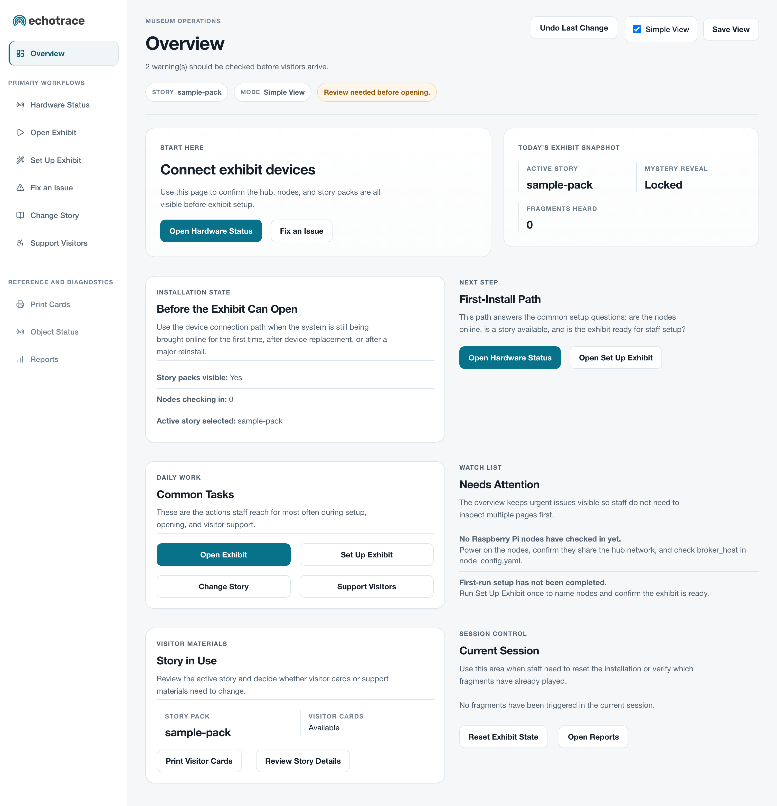
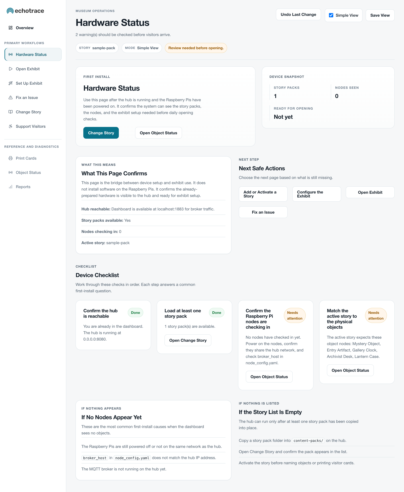
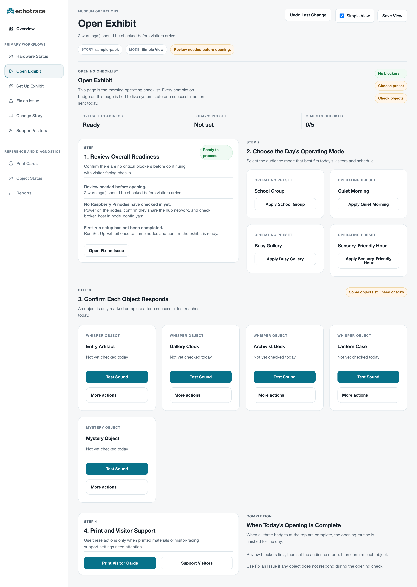
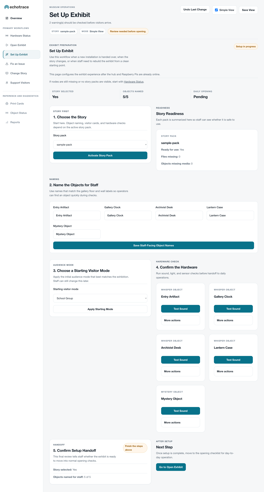
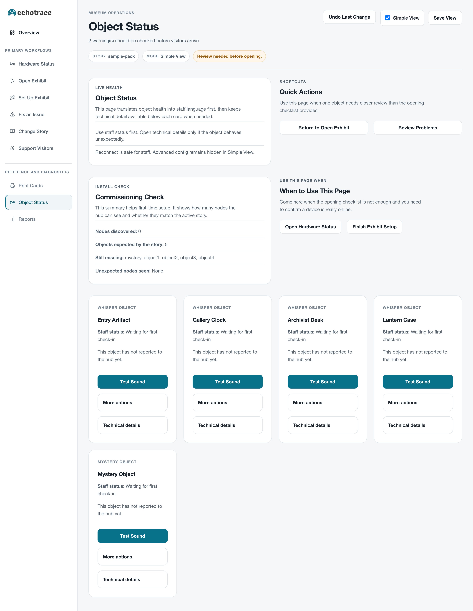
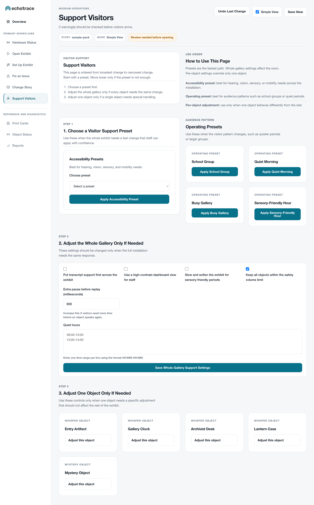
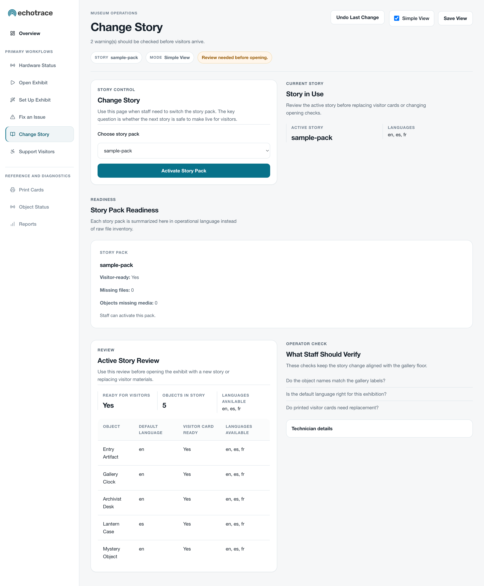
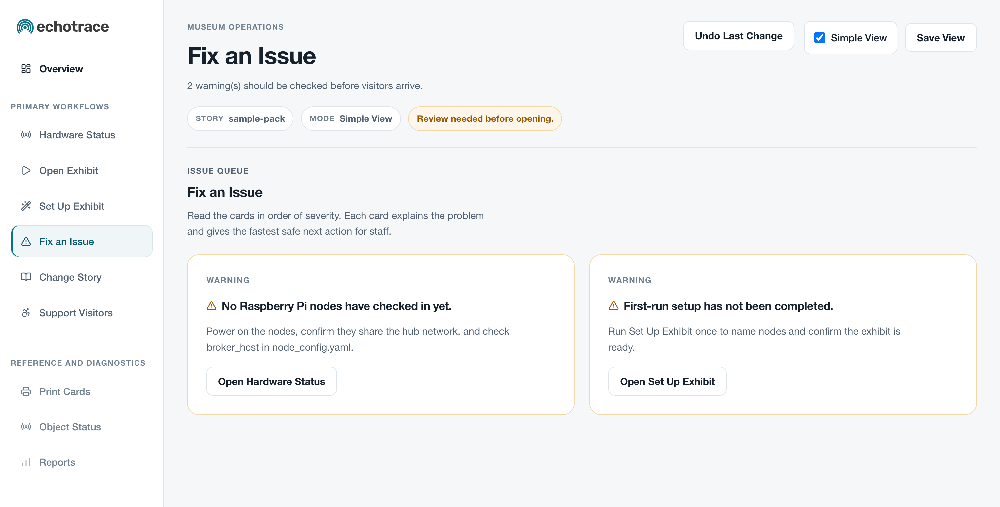
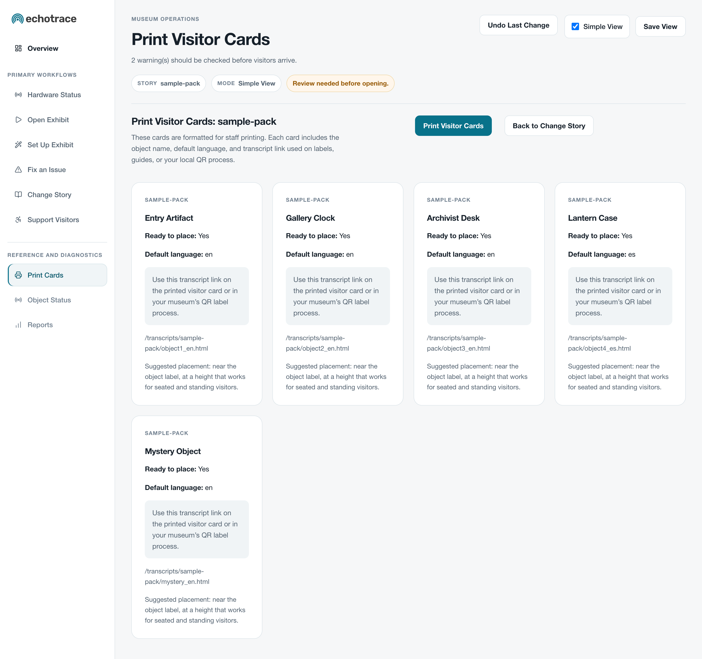
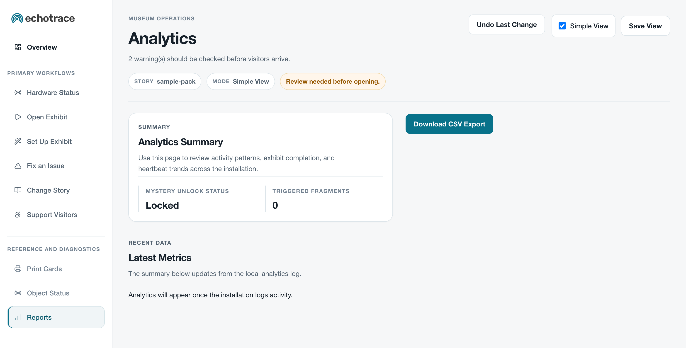

# echotrace: Whispering Objects

EchoTrace is an interactive storytelling installation designed for museums, galleries, and cultural heritage sites. It transforms objects into whispering narrators that share fragments of a larger story when visitors come near. Each “whisper node” uses a Raspberry Pi, a distance sensor, an LED, and a speaker to respond to movement and create a multisensory experience of curiosity and discovery.

As visitors explore, they hear pieces of a hidden story scattered among several artifacts. When enough fragments have been heard, a “mystery object” plays a final chapter that connects the pieces into a shared conclusion. Every step and pause becomes part of the interpretive process. Visitors learn through movement, listening, and reflection.

For museum staff, EchoTrace is designed to be easy to manage and adaptable to different exhibitions. It includes a browser-based dashboard for guided setup, daily opening checks, accessibility settings, content pack changes, transcript label printing, and engagement review. The system runs entirely on a local network, without requiring internet access. EchoTrace demonstrates how physical computing and inclusive design can deepen engagement and learning in informal museum settings.

## Features

- **Distributed architecture (hub and nodes)**  
  The system includes a central “hub” Raspberry Pi and five “node” devices: four whispering objects and one mystery object. The hub manages coordination, content, and analytics, while each node handles sensing and playback. Communication uses **MQTT (Message Queuing Telemetry Transport)**, a lightweight messaging protocol common in Internet of Things systems. MQTT allows reliable communication across the local network even without internet access.

- **Proximity-responsive storytelling**  
  Each node uses a **VL53L1X time-of-flight sensor** to detect distance. At a distance, the object emits a faint whisper. As a visitor approaches, the story becomes clear and audible. This shifting soundscape connects movement and interpretation, making space and curiosity part of the learning experience.

- **Narrative unlock system**  
  The hub tracks which story fragments have played. When a configurable number of unique fragments have been heard, the hub signals the mystery object to play the final chapter. This encourages collaboration, since no single visitor can hear the entire story alone.

- **Accessibility and inclusion**  
  EchoTrace can be adapted to visitor needs. Features include captions and transcripts via QR codes, multilingual content in English, French, and Spanish, adjustable sound and light levels, high-contrast visual options, and sensory-friendly settings. Presets make it easy for staff to enable profiles such as “hard of hearing,” “low vision,” “sensory-friendly,” or “mobility-aware.”

- **Modular content packs**  
  Story content is stored in modular packs that contain YAML metadata, MP3 or WAV audio files, and multilingual HTML transcripts. Staff can replace or edit packs without programming. This makes the system reusable across exhibitions and adaptable to different stories and collections.

- **Staff-friendly operations**  
  The dashboard includes a Set Up Exhibit workflow, an Open Exhibit page, one-click node tests, a plain-language Fix an Issue view, operational presets, and Print Visitor Cards. Staff can work in a simplified day-to-day view, while technician tools remain available when needed. These tools are designed for museum teams who are comfortable with exhibit operations but do not work in code.

- **Offline analytics**  
  All visitor interactions are logged locally as CSV files on the hub. The dashboard summarizes engagement data such as number of triggers and completion rate. No personal information is collected, keeping data management simple and ethical.

## Visitor Interactions

1. **Attraction: the call of the whisper**  
   Faint sounds and soft light draw visitors closer. Each object seems alive and quietly invites approach.

2. **Embodied listening: movement as participation**  
   As a visitor approaches, the whisper becomes clear. The LED brightens, and optional haptic feedback adds a tactile rhythm. The visitor’s motion becomes part of the story experience.

3. **Interpretation through exploration**  
   Each object tells only a fragment. Visitors compare what they have heard, revisit objects, and scan QR codes for transcripts. The story becomes a puzzle to piece together.

4. **Shared discovery and the mystery reveal**  
   After enough fragments have been triggered, whether by one visitor or several, the mystery object plays the final chapter. The group experiences the conclusion together.

5. **Reflection and return**  
   Visitors often return to earlier objects to re-listen. This reflection deepens understanding and highlights how movement and curiosity shape interpretation.

## Learning Goals

- **Constructivist learning through storytelling**  
  Visitors build understanding by gathering and connecting story fragments. Each interaction becomes an act of investigation, mirroring how learning in museums often happens through exploration and curiosity.

- **Embodied cognition and spatial learning**  
  Movement is part of how visitors make sense of information. The sensors and light or sound feedback connect motion, perception, and interpretation, showing how physical engagement supports learning.

- **Collaborative and social learning**  
  No single visitor can hear the whole story alone. The design encourages sharing, discussion, and cooperative discovery, reflecting how people learn through social interaction.

- **Inclusive and multimodal participation**  
  Audio, light, vibration, and text work together so visitors with different sensory or linguistic backgrounds can participate. Accessibility features model Universal Design for Learning principles in a museum setting.

- **Reflection and metacognition**  
  The final mystery object encourages visitors to think about how they formed meaning. Revisiting earlier fragments promotes awareness of their own interpretive process.

## Admin Dashboard Highlights

The admin dashboard provides clear, real-time control over the installation. It is designed for museum staff and requires no programming knowledge. Each section offers visual feedback, simple controls, and instant updates through MQTT communication.

1. **Overview**  
   Acts as a command center that recommends the next safe task, summarizes the active story, highlights current issues, and links directly into the main staff workflows. It also shows live narrative state and allows staff to reset the exhibit state for a fresh visitor run.

2. **Set Up Exhibit**  
   Guides staff through first-run tasks such as selecting a story pack, naming objects for staff use, choosing a starting visitor mode, checking hardware, and confirming that the exhibit is ready to move into daily operation. This is the recommended starting point after installation or exhibition changes.

3. **Open Exhibit**  
   Provides a simple opening routine for front-line staff. It surfaces the current system status, highlights any blockers that need attention, confirms the day’s operating mode, and offers one-click sound, light, sensor, and reconnect tests.

4. **Object Status**  
   Lists all active objects with their staff-facing names, roles, and current status. Each entry includes quick tools to test light, audio, and sensor behavior, along with reconnect controls. Technical details and advanced configuration tools are still available in Technician View.

5. **Support Visitors**  
   Helps staff work from broad support changes to narrow ones. Presets can be applied first, whole-gallery settings can be adjusted when needed, and per-object support settings can be used only when one object needs special handling. All updates take effect immediately.

6. **Change Story**  
   Allows staff to activate new content packs, review language availability, and confirm that required audio and transcript files exist before going live. Story packs are summarized in operational language so staff can tell whether a pack is ready for visitors or needs technician attention.

7. **Fix an Issue and Print Visitor Cards**  
   The Fix an Issue view lists problems in plain language and offers direct next steps such as reconnecting an object or returning to the relevant workflow. The Print Visitor Cards view prepares object names, default languages, and transcript links in a print-friendly layout for visitor cards and local QR label workflows.

8. **Analytics**  
   Displays engagement statistics such as number of interactions, completion rates, and average time between triggers. CSV data can be exported for evaluation and reporting. The dashboard provides insights into how visitors are engaging without tracking individuals.

## Admin Dashboard Screenshots

  
*Overview — The main command center recommends the next safe staff action, displays today's exhibit snapshot (active story, mystery reveal state, and fragments heard), surfaces active issues, and links to common daily tasks and session controls.*

---

  
*Hardware Status — Confirms the hub can see story packs and Raspberry Pi nodes after initial power-on. A step-by-step device checklist walks through commissioning in order, with next-step links for any items that need attention.*

---

  
*Open Exhibit — The morning opening checklist for front-line staff. Reviews overall system readiness, lets staff apply a daily operating preset (School Group, Quiet Morning, Busy Gallery, or Sensory-Friendly Hour), and provides one-click sound tests for every exhibit object.*

---

  
*Set Up Exhibit — Guides staff through initial exhibition configuration: choosing a story pack, naming objects to match gallery floor labels, selecting a starting visitor mode, running hardware checks, and confirming the exhibit is ready for daily opening.*

---

  
*Object Status — Lists every exhibit object with its staff-facing name, current health status, and quick-action buttons for sound, light, and sensor tests. Technical details and advanced configuration tools are available in Technician View.*

---

  
*Support Visitors — Lets staff apply broad accessibility presets, adjust whole-gallery settings such as captions, quiet hours, and sensory-friendly playback, and fine-tune individual objects only when a single object needs special handling.*

---

  
*Change Story — Activates a new content pack and confirms it is visitor-ready. Shows a pack readiness summary, a per-object language availability table, and an operator checklist to verify names, default languages, and visitor card status before going live.*

---

  
*Fix an Issue — Lists active problems in severity order using plain-language warning cards. Each card describes the issue and provides a direct link to the recommended next action, such as opening Hardware Status or running exhibit setup.*

---

  
*Print Visitor Cards — Prepares formatted visitor card previews for each exhibit object, showing the object name, default language, transcript link for QR codes, and suggested label placement, with a single-click print action.*

---

  
*Analytics — Displays engagement statistics including mystery unlock status, triggered fragment count, and recent activity metrics. Administrators can export raw event data as CSV for evaluation and reporting.*

## Hardware Checklist

| Role | Core Hardware |
|------|----------------|
| Hub | Raspberry Pi 4 or 5, 32 GB microSD, Mosquitto MQTT broker, Flask dashboard |
| Whisper Nodes (×4) | Raspberry Pi Zero 2 W, VL53L1X sensor, LED + resistor, small amplifier + speaker, optional haptic motor |
| Mystery Node (×1) | Same as whisper node with finale audio content |
| Fabrication | 3D-printed bezels or LED holders (STL), laser-cut panels (DXF), mounting hardware |

See `docs/hardware_setup.md` for detailed wiring, installation, and maintenance instructions.

## Content Packs

- Stored under `content-packs/<pack-name>/` with YAML metadata, audio files, and HTML transcripts.  
- Each pack defines node roles, languages, and file mappings.  
- Transcripts are served locally at `/transcripts/<pack>/<filename>.html` and can be linked with QR codes.  
- See `docs/content_pack_guide.md` for authoring and localization details.

## Accessibility Suite

- Global toggles for captions, high-contrast mode, sensory-friendly playback, volume limits, mobility buffers, and quiet hours.  
- Presets for hearing, vision, sensory, and mobility support.  
- Per-node overrides for brightness, playback speed, repetition, and volume.  
- Accessibility profiles are saved in YAML and applied instantly through MQTT.

## Analytics and Privacy

- Logged events include `heartbeat_received`, `fragment_triggered`, `narrative_unlocked`, `config_push_ok`, `config_push_timeout`, and `admin_action`.  
- Dashboard summaries display counts, rates, and timing averages without collecting identifying data.  
- Data remain local to the hub unless exported by an administrator for evaluation.

## Quick Start

This section is written for museum staff, exhibit developers, and project partners who may be comfortable following technical steps but do not work as software engineers. If you are setting up EchoTrace for the first time, use the checklist below in order.

### If your Raspberry Pis are still in their boxes

Start with **Deployment Steps (Production)** below, beginning at **1. Prepare the hub**.

That section covers the full zero-to-working path:

1. Flash Raspberry Pi OS onto each microSD card.
2. Prepare the hub Raspberry Pi first.
3. Prepare one node Raspberry Pi at a time.
4. Enable the services so everything starts automatically after reboot.
5. Return to this Quick Start section only after the hub dashboard opens in a browser and at least one node appears in the dashboard.

### Before you begin

Make sure you have:

1. One hub Raspberry Pi and five node Raspberry Pis.
2. One microSD card for each Raspberry Pi.
3. A local network that all devices can join.
4. Power supplies, speakers, sensors, and LEDs connected according to `docs/hardware_setup.md`.
5. A keyboard, mouse, and monitor for initial setup, or another computer on the same local network.
6. Administrator username and password for the dashboard.
7. A story pack placed in `content-packs/` on the hub.

If you do not yet have Raspberry Pi OS installed, the repository copied onto the devices, and the services enabled, stop here and use **Deployment Steps (Production)** first.

### Quick Start for museum staff

1. Power on the hub Raspberry Pi first.
   Wait about one minute for the operating system, dashboard, and MQTT broker to start.

2. Power on each node Raspberry Pi.
   The nodes should begin checking in automatically after boot.

3. Confirm that the hub and nodes are on the same local network.
   If the nodes do not appear later in the dashboard, this is the first thing to check.

4. Open the dashboard from a browser on the same network.
   Go to `http://<hub-ip>:8080/`.
   If you do not know the hub IP address, connect a monitor to the hub once and run:
   ```
   hostname -I
   ```

5. Sign in with the administrator username and password configured for the exhibit.

6. Open **Set Up Exhibit** if this is a new installation or a newly changed exhibition.
   Use it to:
   - choose the active story pack
   - assign friendly names to objects
   - choose the starting visitor mode
   - confirm that each object responds and the system is marked ready

   If you do not see a story pack to choose from, stop here and go to **Deployment Steps (Production)**, section **4. Load exhibit content**.

7. Open **Open Exhibit** before opening to visitors.
   Use it to:
   - confirm the top status banner says the system is ready
   - run **Test Sound** and **Test Light** for each object
   - apply the correct operational preset for the day
   - open **Fix an Issue** if any blockers appear

8. Open **Change Story** and confirm the correct pack is active.
   The dashboard now checks for missing audio or transcript files before activation. If something is missing, it will show a checklist instead of silently activating an incomplete pack.

9. Open **Support Visitors** and choose the correct preset.
   For example, use a quieter preset for sensory-friendly hours or a higher-caption workflow for groups who need more text support.

10. Open **Print Visitor Cards** and print updated cards if the pack, language, or object names changed.

11. Walk the gallery once before visitors arrive.
    Approach each object to confirm that sound, light, and sensor behavior feel appropriate in the actual space.

12. If anything looks wrong, open **Fix an Issue** first.
    Read the red issue cards before changing settings elsewhere in the dashboard.

### Quick Start for local development and testing

If you are preparing or testing EchoTrace on a workstation:

1. Create a virtual environment and install dependencies:
   ```
   python3 -m venv .venv
   source .venv/bin/activate
   pip install -r requirements.txt -r requirements-dev.txt
   ```

2. Run the existing verification suite:
   ```
   python3 -m ruff check .
   python3 -m mypy hub pi_nodes shared
   python3 -m pytest -q
   ```

3. Run the hub and node services in mock mode:
   - `make run-hub` starts the dashboard and listener in development mode.
   - `make run-node` starts a mocked node service loop using test hardware mocks.

4. Open the dashboard and test the staff workflow:
   - Set Up Exhibit
   - Open Exhibit
   - Change Story
   - Support Visitors
   - Print Visitor Cards

## Deployment Steps (Production)

This section assumes EchoTrace is being installed in a museum, gallery, or classroom exhibition where daily operators may not be technical staff. The goal is a stable, repeatable deployment that can be opened and closed by front-line staff with minimal intervention.

### 1. Prepare the hub

This section is for the single Raspberry Pi that will host the dashboard and coordinate all nodes.

1. Unbox the Raspberry Pi that will be the hub.
2. Flash Raspberry Pi OS Lite onto its microSD card.
3. Insert the card, connect the hub to power and the local network, and boot it.
4. Connect a monitor and keyboard for first setup, or enable SSH if you manage Raspberry Pis remotely.
5. Log into the hub and clone this repository into `/opt/echotrace`:
   ```
   cd /opt
   sudo git clone https://github.com/wunderkammer-labs/echotrace-whispering-objects.git echotrace
   sudo chown -R "$USER":"$USER" /opt/echotrace
   ```
6. Change into `/opt/echotrace`.
7. Create a Python virtual environment and install dependencies:
   ```
   python3 -m venv .venv
   . .venv/bin/activate
   make install
   ```
8. Configure administrator credentials in the environment used by the hub service, including:
   - `ECHOTRACE_ADMIN_USER`
   - `ECHOTRACE_ADMIN_PASS`
9. Install and enable Mosquitto on the hub:
   ```
   sudo apt install mosquitto mosquitto-clients
   sudo systemctl enable --now mosquitto
   ```
10. Confirm the hub is reachable on the museum’s local network.
11. Note the hub IP address by running:
   ```
   hostname -I
   ```

At the end of this section, you should have one working Raspberry Pi that can host the dashboard and MQTT broker.

### 2. Prepare each node

Prepare one node at a time. Do not try to configure all five at once.

1. Unbox one Raspberry Pi node.
2. Flash Raspberry Pi OS Lite onto its microSD card.
3. Insert the card, connect the node to power and the same local network as the hub, and boot it.
4. Connect the speaker, distance sensor, LED, and optional haptic hardware.
5. Clone this repository onto the node, typically at `/opt/echotrace-node`:
   ```
   cd /opt
   sudo git clone https://github.com/wunderkammer-labs/echotrace-whispering-objects.git echotrace-node
   sudo chown -R "$USER":"$USER" /opt/echotrace-node
   ```
6. Change into `/opt/echotrace-node`.
7. Create a Python virtual environment and install dependencies:
   ```
   python3 -m venv .venv
   . .venv/bin/activate
   make install
   ```
8. Review `pi_nodes/node_config.yaml` and set:
   - the correct `node_id`
   - the correct role for that device
   - the correct GPIO pin assignments
   - the hub hostname or IP for the MQTT broker
9. Label the physical node so its case matches the `node_id`.
10. Repeat this section for each remaining node.

At the end of this section, each node should know its own identity and how to reach the hub.

### 3. Configure services to start automatically

Copy the provided systemd unit files, adjust paths if needed, and enable them:

```
sudo systemctl daemon-reload
sudo systemctl enable --now echotrace-hub
sudo systemctl enable --now echotrace-node
```

For clarity:

1. On the hub, copy `system/hub.service` to `/etc/systemd/system/echotrace-hub.service`.
2. On each node, copy `system/node.service` to `/etc/systemd/system/echotrace-node.service`.
3. Reload systemd with `sudo systemctl daemon-reload`.
4. Enable the correct service on each device.

After enabling services, confirm success:

1. Reboot the hub once and confirm the dashboard returns automatically.
2. Reboot a sample node once and confirm it reconnects and appears in the dashboard.
3. If a device does not return automatically, run:
   ```
   sudo systemctl status echotrace-hub
   ```
   on the hub, or:
   ```
   sudo systemctl status echotrace-node
   ```
   on a node.

### 4. Load exhibit content

1. Add content packs under `content-packs/`.
2. Confirm each pack contains:
   - `pack.yaml`
   - audio files for each assigned node
   - transcript HTML files for each assigned node and language
3. Open **Change Story** in the dashboard and activate the pack.
4. Review the validation checklist shown by the dashboard.
   If files are missing, correct the pack before opening the exhibit.

At the end of this section, you should be able to sign into the dashboard and see at least one valid story pack.

### 5. Complete the staff-facing setup

1. Open **Set Up Exhibit** and assign friendly names that match gallery labels.
2. Open **Open Exhibit** and run sound and light tests for every object.
3. Open **Support Visitors** and save the default preset for the exhibition.
4. Open **Print Visitor Cards** and print updated visitor cards or transcript links.
5. Open **Fix an Issue** and make sure no red issues remain.

At this point, the system should be ready for daily operation by museum staff.

### 6. Daily operating model for museum staff

Use the following routine each day:

1. Open the dashboard.
2. Go to **Open Exhibit**.
3. Confirm the status banner is green or otherwise states that the system is ready.
4. Run one-click sound and light tests.
5. Apply the day’s operational preset if needed.
6. Open the exhibit.

If something goes wrong during the day:

1. Open **Fix an Issue**.
2. Read the red issue cards first.
3. Follow the suggested action text.
4. Use **Reconnect** for stale nodes.
5. Use **Object Status** only if a more detailed view is needed.

### 7. Maintenance and support

For regular operations:

1. Export analytics CSV files periodically for reporting.
2. Back up content packs and staff settings after major exhibition changes.
3. Reprint visitor cards whenever a pack or language assignment changes.
4. Review `docs/admin_playbook.md` and `docs/operator_cheat_sheet.md` for daily routines and troubleshooting guidance.

## License

Released under the MIT License. See `LICENSE` for details.
